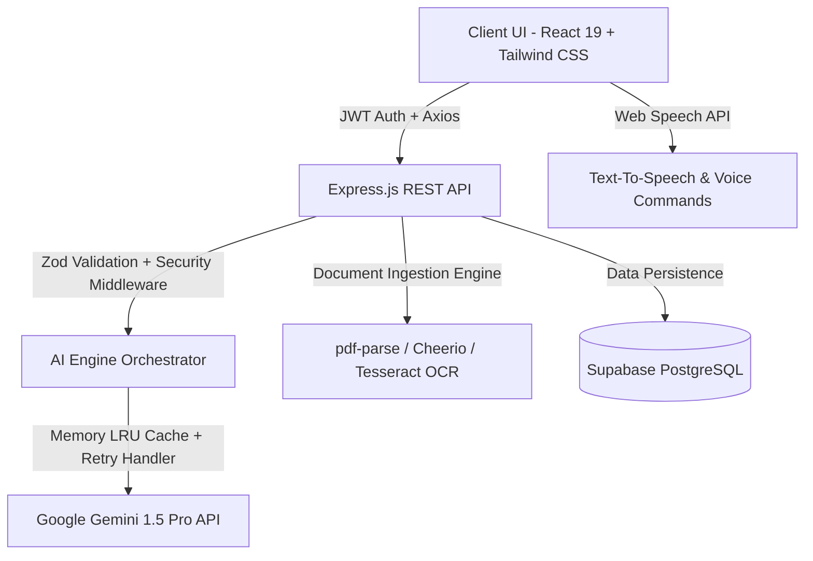

# ascess-1-ai 🚀
> **Enterprise AI-Powered Inclusive Accessibility & Web Audit Platform**

[](https://vitejs.dev/)
[](https://react.dev/)
[](https://tailwindcss.com/)
[](https://ai.google.dev/)
[](https://supabase.com/)

---

## 📌 Problem Statement

Over 1.3 billion people worldwide live with disabilities—including visual impairment, dyslexia, cognitive difficulty, and motor limitations. Most modern web applications fail to meet basic WCAG 2.1 AA standards, rendering digital content inaccessible. Furthermore, content simplification, multi-language screen reading, and real-time accessibility auditing are fragmented across disconnected tools.

---

## 🌟 Solution Overview

**ascess-1-ai** is a unified, production-grade AI accessibility platform powered by **Google Gemini AI** and **Supabase PostgreSQL**. It acts as a 24/7 accessibility assistant:
- **Instant Document & Web Processing**: Ingests PDFs, images (Tesseract OCR), raw text, and live web URLs.
- **Gemini AI Copilot**: Context-aware AI assistant providing text simplification, multi-language translation (14 languages), and document Q&A.
- **Smart WCAG 0-100 Scoring Engine**: Automated auditing with 5-level priority issue categorization (Critical, High, Medium, Low, Info) and AI code rewrites.
- **Inclusive Voice Accessibility**: Built-in Text-to-Speech (TTS), Speech-to-Text (STT) mic listener, and Voice Command parser ("Go to Dashboard", "Enable Dyslexia Mode").
- **Dyslexia & High Contrast Modes**: On-demand OpenDyslexic typography, reading rulers, and high contrast WCAG AAA themes.

---

## 🏗️ Architecture & Technical Workflow



---

## 🔥 Key Features

1. **Google Gemini AI Engine**: 9 REST API endpoints for simplification, translation, audit, alt-text generation, OCR cleaning, summarization, website evaluation, and reading assistance.
2. **Smart Document Hub**: Drag-and-drop PDF parsing, OCR image text extraction, and web scraping.
3. **Voice Accessibility System**: Hands-free voice commands, screen reader controls, speed/pitch adjustments, and microphone STT input.
4. **Dyslexia & High Contrast Suite**: Reading ruler overlay, dyslexia letter-spacing, font size scaling, and WCAG AAA themes.
5. **Multi-Format Report Exporter**: Download audit reports as PDF, JSON, Markdown (.md), or Plain Text (.txt).
6. **Visual Analytics Dashboard**: Track weekly score progression, document type breakdowns, and Gemini AI usage metrics.

---

## 🛠️ Technology Stack

- **Frontend**: React 19, Vite, Tailwind CSS 4, Material UI, Framer Motion, React Icons, React Hook Form, Zod.
- **Backend**: Node.js, Express.js, Supabase Client, JWT, bcryptjs, Helmet, Morgan, CORS, `@google/generative-ai`.
- **Parsing Libraries**: `pdf-parse` (PDF extraction), `cheerio` (Web scraping), `tesseract.js` (Image OCR).

---

## 📂 Project Structure

```
ascess-1-ai/
├── backend/
│   ├── src/
│   │   ├── ai/                      # Gemini AI client, promptBuilder, cache, retryHandler
│   │   ├── config/                  # Environment variables & CORS settings
│   │   ├── controllers/             # Auth, User, AI, Document, Accessibility controllers
│   │   ├── middleware/              # JWT, Validation, Upload, Error handlers
│   │   ├── routes/                  # REST route definitions
│   │   ├── services/                # Document processing & Accessibility audit services
│   │   ├── supabase/                # Database client & helper utilities
│   │   ├── validations/             # Zod validation schemas
│   │   ├── app.js                   # Express application setup
│   │   └── server.js                # Server entry point
│   ├── .env.example
│   └── render.yaml                  # Render deployment config
│
└── frontend/
    ├── src/
    │   ├── components/              # Accessibility toolbar, UI primitives, Layouts
    │   ├── context/                 # Auth, Theme, Speech, Settings, Notification contexts
    │   ├── hooks/                   # useSpeechSynthesis, useSpeechRecognition, useVoiceCommands
    │   ├── pages/                   # 9 main feature pages + auth routes
    │   ├── routes/                  # Protected & Guest routing rules
    │   ├── services/                # Axios API services
    │   ├── App.jsx                  # Root component
    │   └── index.css                # Custom CSS design system & accessibility tokens
    ├── .env.example
    └── vercel.json                  # Vercel deployment spec
```

---

## 🚀 Running Locally

### 1. Prerequisites
- Node.js >= 18.x
- npm >= 9.x

### 2. Backend Setup
```bash
cd backend
npm install
cp .env.example .env
# Fill in your GEMINI_API_KEY and SUPABASE credentials in .env
npm run dev
```
*Backend runs at http://localhost:5000*

### 3. Frontend Setup
```bash
cd frontend
npm install
cp .env.example .env
npm run dev
```
*Frontend runs at http://localhost:5173*

---

## 📄 License
Distributed under the MIT License. See `LICENSE` for details.
